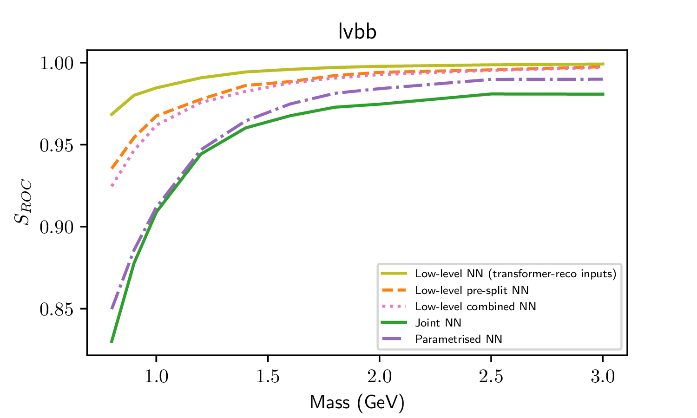
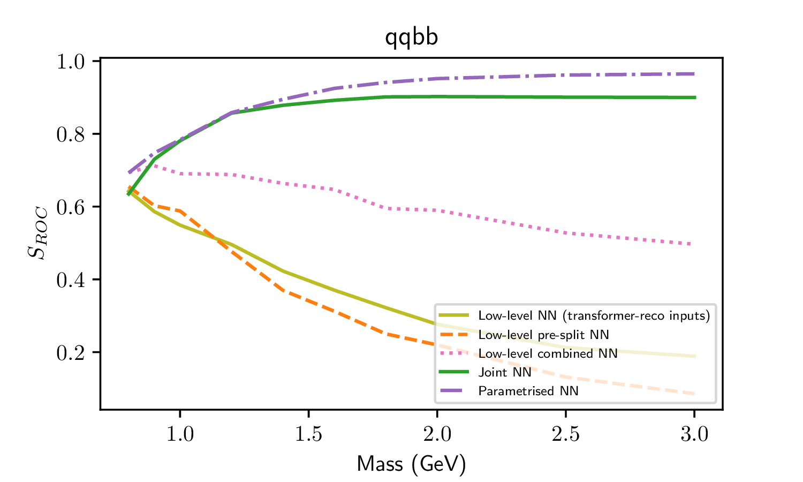
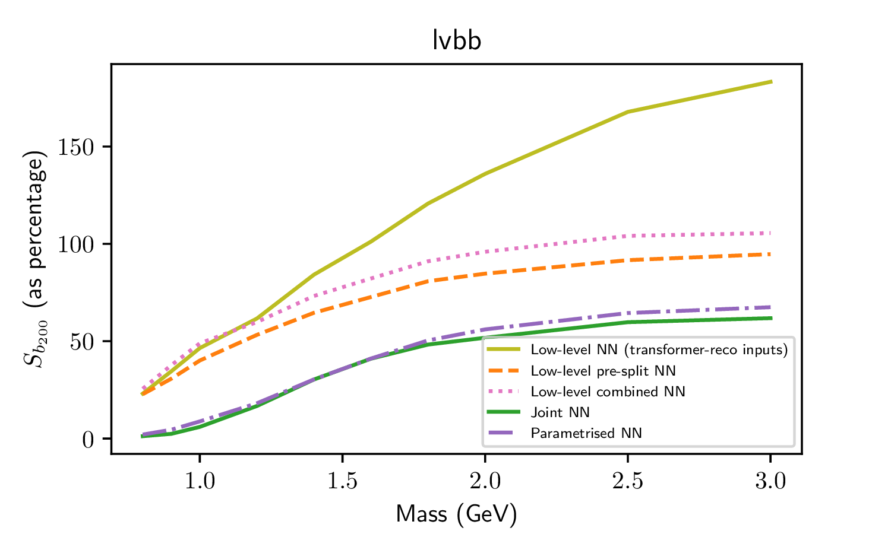
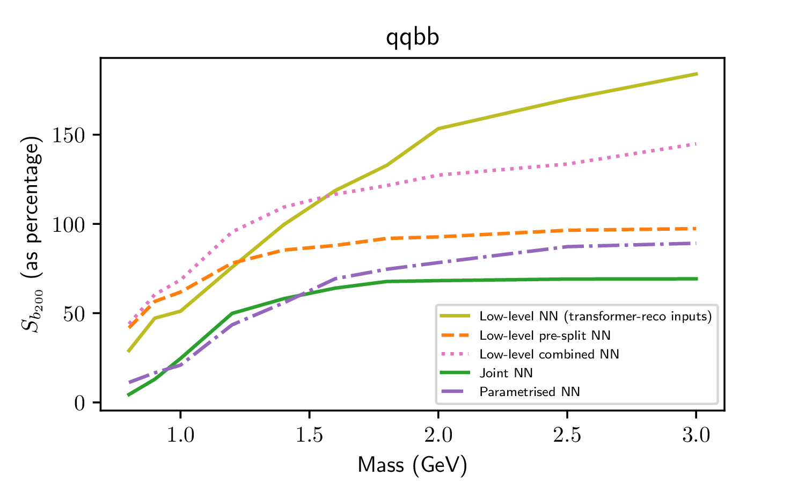

# Charged Higgs Transformer code
Code for training, interpreting & applying transformer-like neural networks to low-level reconstructed objects in particle physics events, for event reconstruction/classification.

For the given analysis, these models lead to signal efficiency increases by factors of ten (low mass points) to two (high mass) at realistic SM background acceptance rates.

## Performance
<!-- lvbb             |  qqbb -->
<!-- :-------------------------:|:-------------------------: -->
<!--   |   -->
The below figures show the percentage[1](#fn1) of signal remaining when a cut is made to accept 200 (MC weighted) background events (a reasonable expected requirement for Signal Regions in this analysis). 
All networks were trained using code from this repository.

<!-- lvbb             |  qqbb -->
<!-- :-------------------------:|:-------------------------: -->
<!--   |   -->

  
  

| Line style | legend entry | Description of model |
|---------------|------------|-------------|
| Lime Green/solid (upper) | Low-level NN (transformer-reco-inputs) | Transformer classifier trained on low-level variables, for input events which were reconstructed using a transformer-reconstruction model |
|Orange/Dashed| Low-level pre-split NN | Transformer classifier trained on low-level variables, for input events which were reconstructed manually (lvbb / qqbb trained separately)|
|Pink/Dotted| Low-level combined NN| Transformer classifier trained on low-level variables, for input events which were reconstructed manually (lvbb / qqbb trained together)|
|Dark Green/solid (lower)|Joint NN| MLP classifier trained on high-level variables, for input events which were reconstructed manually - as in the published analysis, linked [here](https://arxiv.org/abs/2411.03969)|
|Purple/Dot-dash|Parametrised NN| MLP classifier trained on high-level variables, for input events which were reconstructed manually - as proposed in [Parmeterized neural networks for high-energy physics](https://link.springer.com/article/10.1140/epjc/s10052-016-4099-4)|

<!--  -->

<!-- HTML fallback for GitHub (if footnotes aren’t rendered) -->
<b id="fn1">[1]</b> Percentages are taken relative to the total weighted events present in the manual reconstruction, so 100 is the maximum achievable by all methods except the “Low-level NN (transformer-reco inputs)”, which use the newly proposed transformer-based reconstruction instead and therefore have a larger set of correctly reconstructed input events, allowing them to retain more than 100% of the original events.

## Main run files
Note all of these are split into jupyter cell tags (esp. useful for mech interp script)
- To train a reconstruction network (on signal only) on low-level object information, `python TrainLowLevelReconstruction.py`
- To train a classification network (for signal1 [vs signal2] vs background) on low-level object information, `python TrainLowLevelClassifier.py`
- To train a classification network (for signal vs background) on high-level *already reconstructed* event information, `python TrainHighLevelClassifier.py`
- To play around with some interpretability, `python RunLowLevelInterp.py`

## Other run files
Important files (in ~chronological workflow order):
- `cpp_code/` folder contains code for processing ROOT files with initial cuts, decorating the data with the old classificaitons and publication neural network scores, etc.
- `preprocessing-scripts/preprocessLowLevel.py` **prepares data** for the low-level networks. Contains code for reading ROOT files, doing any necessary samples filtering/resampling for a (set of) training runs & preparing data into numpy .bin format, with shape [batch object variable]. Lots of options for different selections, variables to write, etc. This is primarily used to prepare signal-only datasets for training reconstruction networks, or to prepare signal-and-background datasets for training classification networks, *if* the old reconstruciton method is to be used.
- `preprocessing-scripts/preprocessHighLevel.py` **prepares data** for the high-level networks. Broadly does the same thing as above, but writes a [batch variable] tensor of *high-level* variables per event. This is used to prepare signal-and-background datasets for training basic MLP classification networks (baseline analysis method)
- `preprocessing-scripts/preprocessLowLevelApplyRecoSplitChannels.py` **prepares data** for the low-level classifier network, assuming we use reconstruction network. Essentially does the data selection & preparation again, but now also applies the reconstruction network to split into the two possible decay channels based on this. We end up with non-overlapping datasets for each of qqbb & lvbb.
- `preprocessing-scripts/preprocessLowToHighApplyReco.py` **prepares data** for the high-level classifier network, assuming we use reconstruction network. Essentially does the data selection & preparation again as above, applying the reconstruction network to split into the two possible decay channels based on this THEN calculates the high-level variables. We end up with non-overlapping datasets for each of qqbb & lvbb.
- `postprocessing-scripts/ApplyRecoAndClassifiersToRoot.py` applies these networks and rewrites to root files for further analysis

## Utils folders

- `utils/` contains functions which are generally useful across all files
- `dataloaders/` contains the dataloader code for reading in preprocessed data for training, applying, or interpreting
- `metrics/` contains a class & methods for tracking performance of the different networks for event reconstruction/classification
- `models/` contains the model code for the different networks
- `preprocessing-scripts/` contains the code for preprocessing the data for the different networks (high-level & low-level, from raw or using the reconstruction network)
- `postprocessing-scripts/` contains the code for applying the networks to the data & rewriting to root files for further analysis
- `interp/` contains the code for trying to do mech interp on the low-level info networks
